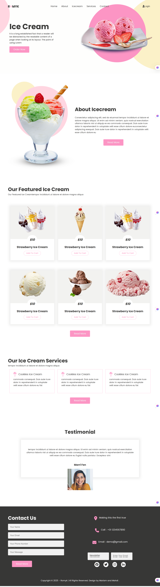

#  ice cream website 
An ice cream website is a website that focuses on ice cream-related content — it could be for a business that sells ice cream, a brand that makes ice cream, or even a home about ice cream recipes and reviews.

## Project Overview 
This is project developed and design by Group: a of Group: b
#### members
  - Mahdi Ali iltireh
  - Maryam Mohamed Ali

### Website Sections
 - Home: A delicious welcome to your site with a big, eye-catching image of your best-selling ice cream. Include a short introduction and highlight current promotions or best flavors. Add a "Visit Us" or "Order Now" button.
 - About :what makes your ice cream special, and your passion for frozen treats.
 - Icecream:Every month, we spotlight a few standout flavors that our customers can't get enough of.        Whether it's a seasonal favorite or a bold new twist, these featured ice creams are made to wow your taste buds. 
 - Services:At SweetChill Ice Cream, we offer more than just delicious scoops. Whether you're planning a party, craving a pint at home, or looking for a fun dessert experience, we've got you covered!
 - Contact :We’d Love to Hear From You!
  Have a question, suggestion, or feedback? Fill out our form or reach us by phone, email, or Instagram.
- 

## Key Pages on an Ice Cream Website

## ✨ Pages

| pages         | 	What it includes                                  |
|------------------|--------------------------------------------------|
| Home             | Big images of ice cream, welcome message         |
| About Us         | Story of the shop or brand                       |
| Services         | Our Ice Cream Services                           |
| Ice Cream        | Our Featured Ice Cream                           |
| Contact          | Phone number, email, address,                    |

---

## Color Reference
| color           | 	Hex     |
|---------------  |:--------- |
| Primary color   | #f1f1f1 |
| Secondary color | #FC95C4 |
| Background Color| #fefefd |
| Text color      | #373736 |

## Fonts 
- "Poppins", sans-serif;

## Screenshoot Full-page 

